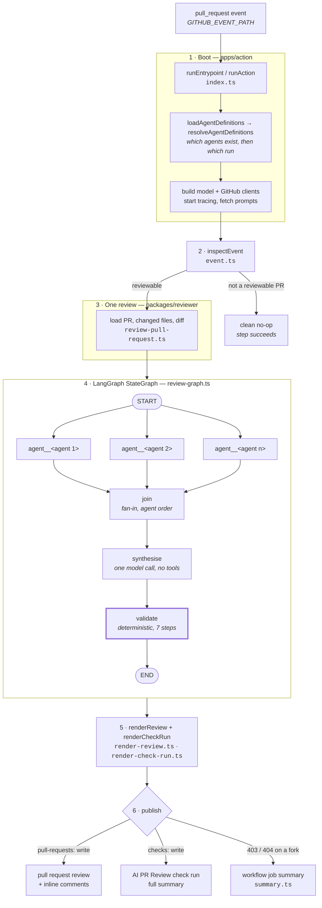

# Agent flow — what runs when

One pull request event in, one review out — inline comments plus a check run.
This document traces that path in order, naming the file that owns each step.

The short version: **agents propose, one synthesiser refines, and
deterministic code decides.** Only the last of those three stages ever reaches
the GitHub API.

Which agents run is configuration, not structure. There is no built-in
set: a repository declares its agents in `.github/pr-review-agents.yml`, and a run
with no such file fails rather than guessing. Everywhere below that a count
would be tempting, the pipeline reads the run's agent set instead.

---

## The whole pipeline



The one line to remember: **`validate` is the only node whose output the
caller may trust.** Everything upstream of it is untrusted model output.

---

## Stage by stage

### 1 · Boot — the Action entrypoint

`apps/action/src/index.ts`

`runEntrypoint()` runs at import time but returns immediately unless
`GITHUB_ACTIONS === "true"`, so importing the module in a test does no work.
`runAction` then resolves configuration in a deliberate order.

The agent set is resolved *first*, before any client exists, because a missing
config file or a typo'd agent name is a mistake in the repository and must cost
nothing to discover:

```ts
// apps/action/src/index.ts
const configured = await loadAgentDefinitions({ readFile, path });
const agents = resolveAgentDefinitions(getInput(env, "agents"), configured);
```

Two steps, two different failures. `loadAgentDefinitions`
(`packages/ai/src/agents/config.ts`) reads the repository's agents and throws
when there are none to read — nothing ships by default, so an absent config is
an error, not an empty default. `resolveAgentDefinitions`
(`packages/ai/src/agents/agent-set.ts`) then narrows that set and throws on a
name it does not contain rather than dropping it.

Both would otherwise produce a review that reports nothing and looks exactly
like a clean bill of health.

Then clients, tracing, and prompts, in that order: tracing starts before the
prompt fetch so the fetch's own spans are captured.

| Step | Function | Fails the run? |
| --- | --- | --- |
| Load configured agents | `loadAgentDefinitions` | Yes — missing or malformed config |
| Narrow to the selection | `resolveAgentDefinitions` | Yes — unknown name |
| Model client | `createModelClient` | Yes — unknown provider or missing key |
| Langfuse tracing | `createLangfuseRuntime` | No — optional |
| Managed prompts | `loadManagedPrompts` | No — falls back per prompt |
| GitHub client | `createTokenClient` | Yes — missing token |

### 2 · Is this even a review?

`apps/action/src/event.ts` → `inspectEvent` (line 40)

Two outcomes, and the distinction matters:

- **Not a review** — wrong event name, or an action like `labeled`. Returns
  `{ review: false, reason }`, logs `review.skipped`, and the step *succeeds*.
  Most workflow triggers are not reviews.
- **Malformed** — claims to be a supported `pull_request` event but fails the
  schema. This *throws*: it is a bug worth failing the workflow over.

### 3 · Load the pull request

`packages/reviewer/src/review-pull-request.ts` → `reviewPullRequest` (line 189)

Three GitHub reads, concurrently — this is the only place the PR context is
built:

```ts
// packages/reviewer/src/review-pull-request.ts:154
const [pullRequest, changedFiles, diff] = await Promise.all([
  client.getPullRequest(ref),
  client.listChangedFiles(ref),
  client.getDiff(ref),
]);
```

`changedFiles` is the single source of truth for the rest of the run. The
agents see it, and `validate` filters against it — so validation can never
check findings against a different file list than the one the agents reviewed.

#### 3a · The path gate

`packages/ai/src/agents/agent-set.ts` → `gateAgentsByPaths`

The agent set was resolved at boot, before the pull request existed. This is
the first point where an agent's `paths` can be answered, so the gate runs
here — pure, over `changedFiles[].filename`:

```ts
const { active, skipped } = gateAgentsByPaths(agents, filenames);
```

A gate, not a narrowing: the agents it wakes get the same `ReviewContext` and
the same prompts as always, so the cache prefix they share is untouched. An
agent with no `paths` is always active.

Every skipped agent is logged as `agent.skipped` and named in the check-run
summary. When `active` is empty the pipeline is never built — `buildReviewGraph`
throws on an empty set, and more to the point a review that ran nothing must
publish `renderNoAgentMatched`'s neutral check rather than a clean bill of
health. The `agents` input overrides the gate: naming agents is asking for
those agents.

### 4 · The graph

`packages/reviewer/src/review-graph.ts` → `buildReviewGraph` (line 196)

Agent nodes are added dynamically, one per selected agent, each wired straight
from `START` so they run concurrently:

```ts
// packages/reviewer/src/review-graph.ts:197
const agentNodeNames = agents.map((agent, index) => {
  const nodeName = `agent__${agent.name}`;
  graph.addNode(nodeName, agentNode(index, agent));
  graph.addEdge(START, nodeName);
  return nodeName;
});

return graph
  .addNode("join", makeJoinNode(agents.length))
  .addEdge(agentNodeNames, "join")   // fan-in: waits for every agent
  .addNode("synthesise", makeSynthesiseNode(synthesiser))
  .addEdge("join", "synthesise")
  .addNode("validate", makeValidateNode(agents.map((a) => a.name)))
  .addEdge("synthesise", "validate")
  .addEdge("validate", END)
  .compile();
```

#### 4a · Each agent node

`packages/ai/src/agents/runtime.ts` → `createReviewAgent` (line 180)

Every agent shares one runtime. A `AgentDefinition` — which is just the three
fields a config entry carries — supplies the role, focus text, and category;
the loop, the six tools, the injection hardening, and the output contract are
identical by construction, so a new agent costs a YAML entry and no code.

```ts
// packages/ai/src/agents/runtime.ts:315
for (let turn = 1; ; turn += 1) {
  const response = await callModel();
  const toolUses = toolUseBlocks(response.content);
  if (toolUses.length === 0) {
    finalText = textOf(response.content);   // this message is the answer
    break;
  }
  if (turn >= maxTurns) {
    throw turnCapExceeded;
  }
  messages.push({ role: "assistant", content: response.content });
  messages.push({ role: "user", content: await answerToolUses(toolUses) });
}
```

The cap (`DEFAULT_MAX_TURNS = 12`) bounds **model calls**, not tool round
trips. A response with no tool uses always ends the run on the call it arrived
on, so the cap can never burn a call the agent cannot answer.

After parsing, the runtime **filters** findings to the agent's own category.
Cross-category leaks are dropped, never re-stamped — re-stamping would
fabricate a claim the model never made.

**The six tools** (`packages/ai/src/agents/tools.ts:143`) are the only tools any agent
ever gets. There is no write, comment, approve, merge, or execute tool
anywhere in the package:

| Tool | Reads |
| --- | --- |
| `get_pull_request` | Title, description, author, branches, SHAs |
| `list_changed_files` | The changed-file list |
| `get_diff` | The full unified diff |
| `get_file` | One file at the **head** SHA |
| `get_base_file` | One file at the **base** SHA |
| `search_repository` | Code search, scoped to this repo |

Every input is Zod-validated before it touches the GitHub client, and
`dispatchReviewTool` (line 230) **never throws** — failures come back as
`{ ok: false }` and are handed to the model as an error `tool_result` so the
loop keeps going.

#### 4b · `join` — fan-in

`makeJoinNode` (line 118). LangGraph only runs it once every incoming edge's
source has completed. It re-sorts outcomes by the agent's **input position**,
never completion order, so the result is deterministic. Then:

```ts
if (agentFailures.length === agentCount) {
  throw new Error(`every review agent failed — ${details}`);
}
```

One failed agent does not fail the review. All of them does.

#### 4c · `synthesise`

`makeSynthesiseNode` (line 146) → `createSynthesiser`
(`packages/ai/src/agents/synthesiser.ts:81`)

**One** model call. No tools, no loop. It dedupes, merges overlaps, drops
speculation, corrects severity, and orders results most important first.

Three paths out:

| Path | Trigger | `synthesisOutcome` |
| --- | --- | --- |
| Skipped | Zero candidates — nothing to refine | `"skipped"` |
| Completed | Model returned valid JSON | `"completed"` |
| Failed | Bad output or API error → **raw candidates used** | `"failed"` |

A synthesis failure never fails the review. Its output is still untrusted
either way, because it flows through the same validation chain.

#### 4d · `validate` — the trust boundary

`packages/reviewer/src/validate-findings.ts:58`

Seven deterministic steps, in this order:

1. **Schema validity** — Zod (`reviewFindingSchema`)
2. **Category is one of the run's agents** — the schema cannot check this,
   since the set is known only at runtime
3. **File exists** among the PR's changed files
4. **Line is an added line** in that file's diff, when a line is given
5. **Confidence ≥ 0.7** (`CONFIDENCE_THRESHOLD`)
6. **Duplicate removal** — the strongest of each group survives
7. **Cap at 10** (`MAX_FINDINGS`), keeping the strongest

"Strongest" is fully deterministic: severity rank, then confidence descending,
then input order.

Dedup runs *before* the cap, so duplicates — which several agents reviewing
one diff produce routinely — cannot consume cap slots and leave the review
short.

This is where a fabricated file path, an invented line number, or a padded
confidence score dies — regardless of how confident the model sounded.

### 5 · Render

`packages/reviewer/src/render-check-run.ts:65` — pure, no I/O.

| Situation | Conclusion |
| --- | --- |
| No findings, no agent failures | `success` — "No issues found" |
| Any findings | `neutral` — advisory; never blocks a merge |
| An agent failed, even with zero findings | `neutral` — an incomplete review must not publish a clean bill of health |
| An agent was skipped by its `paths` | Unchanged — a skip is configured, not a failure; the summary names it |
| **No agent matched** | `neutral`, "No agent reviewed this pull request" — the one case where nothing was read at all |

Line-anchored findings also become inline annotations (GitHub caps these at 50
per request).

### 6 · Publish

`apps/action/src/summary.ts:59` → `createFallbackPublisher`

Try the check run first. On a **403 or 404**, fall back to the workflow job
summary and exit cleanly — that is the fork case, where GitHub hands the
workflow a read-only token.

The check is on status alone, deliberately: matching GitHub's wording
("Resource not accessible by integration") would couple the fallback to text
that is not part of any API contract. Everything else — 401, 429, 5xx, or a
network error with no status at all — propagates and fails the step. None of
those may masquerade as a delivered review.

---

## Where things live

| Path | Owns |
| --- | --- |
| `apps/action/src/index.ts` | Inputs, client construction, wiring |
| `apps/action/src/event.ts` | Actions event parsing, ignore-quietly rule |
| `apps/action/src/handler.ts` | Event → review handoff |
| `apps/action/src/summary.ts` | Fork fallback to the job summary |
| `apps/action/src/langfuse.ts` | Span export for one run |
| `packages/reviewer/src/review-pull-request.ts` | One review, end to end |
| `packages/reviewer/src/review-graph.ts` | The StateGraph |
| `packages/reviewer/src/validate-findings.ts` | The trust boundary |
| `packages/reviewer/src/render-check-run.ts` | Findings → check run payload |
| `packages/reviewer/src/render-review.ts` | Findings → review body + inline comments |
| `.github/pr-review-agents.yml` | The agents this repository reviews with |
| `packages/ai/src/agents/config.ts` | Reading and validating a repository's agents |
| `packages/ai/src/agents/definition.ts` | What an agent is, and its shared system prompt |
| `packages/ai/src/agents/agent-set.ts` | Narrowing an agent set, gating it by path, building its agents |
| `packages/ai/src/agents/path-filter.ts` | What a `paths` list is, and what it matches |
| `packages/ai/src/agents/synthesiser.ts` | The single refining model call |
| `packages/ai/src/agents/runtime.ts` | The shared agentic loop |
| `packages/ai/src/agents/tools.ts` | The six read-only tools |
| `packages/ai/src/prompts.ts` | Managed prompts + fallback |
| `packages/schemas/src/review-finding.ts` | The finding contract |

## What fails the run, and what doesn't

| Event | Result |
| --- | --- |
| Unknown agent name | **Fails** before any model call |
| Missing API key or token | **Fails** |
| Unsupported event / ignored action | Clean no-op, step succeeds |
| Malformed `pull_request` payload | **Fails** |
| One or two agents fail | Review continues; names listed in the check run |
| **Every** agent fails | **Fails** — re-runnable from the Actions UI |
| An agent's `paths` match nothing | Agent is skipped; named in the check run and logged |
| No agent's `paths` match | Clean no-op with a neutral check run; **no model call** |
| A `paths` pattern is malformed or matches nothing by construction | **Fails** before any model call |
| Synthesis fails | Raw candidates published instead |
| A tool call fails | Reported to the model, loop continues |
| Langfuse unreachable | In-code prompts used; no traces |
| Check run forbidden (fork) | Job summary instead; step succeeds |

## Lifecycle log events

Every event of one review carries `repository`, `pullRequestNumber`, and
`headSha`, so an operator can answer "what happened to the review for PR N?"
from the logs alone.

```
review.started → review.loaded
  → agent.skipped ×N            (paths matched nothing)
  → review.no_agents_matched    (and the review ends here)
  → agent.started ×N → agent.completed / agent.failed ×N
  → synthesis.started → synthesis.completed / synthesis.failed / synthesis.skipped
  → findings.validated
  → review.published / review.published.degraded
```

## Running it

```bash
pnpm test        # vitest run
pnpm typecheck   # pnpm -r typecheck
pnpm build       # bundles apps/action to dist/index.mjs
pnpm eval        # review-quality evals against fixture repos
```
