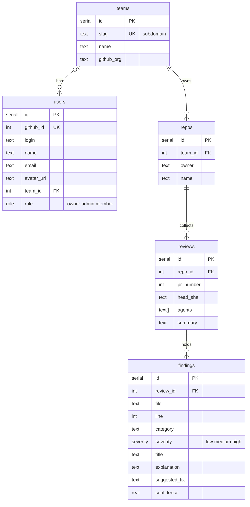

# @pr-review/db

Postgres on Neon, accessed through Drizzle. `db()` returns the client; the
tables are exported from `src/schema.ts`.



- `teams.slug` is the subdomain: `acme` → `acme.<app-domain>`.
- One team per user: `users.team_id`, null until they create or join one.
  Many teams per user later means moving that column into a join table.
- Deleting a team cascades to its repos, reviews and findings; its users stay
  and get `team_id = null`.

## Commands

```bash
pnpm db:generate   # write a migration from schema changes
pnpm db:push       # apply the schema straight to DATABASE_URL (dev)
pnpm db:migrate    # apply pending migrations
pnpm db:studio     # browse the data
```

`DATABASE_URL` comes from Vercel in production and from the nearest
`.env.local` locally.
